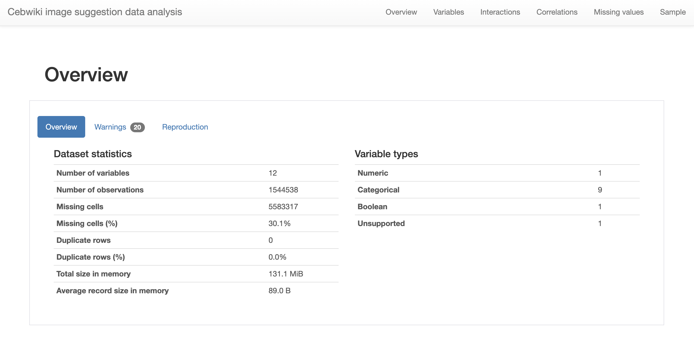
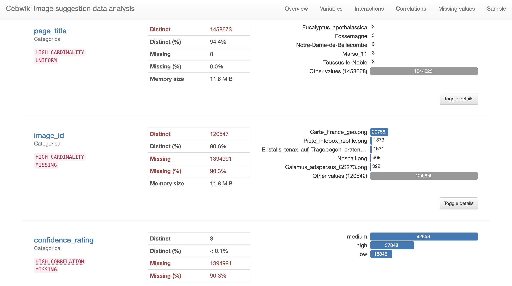
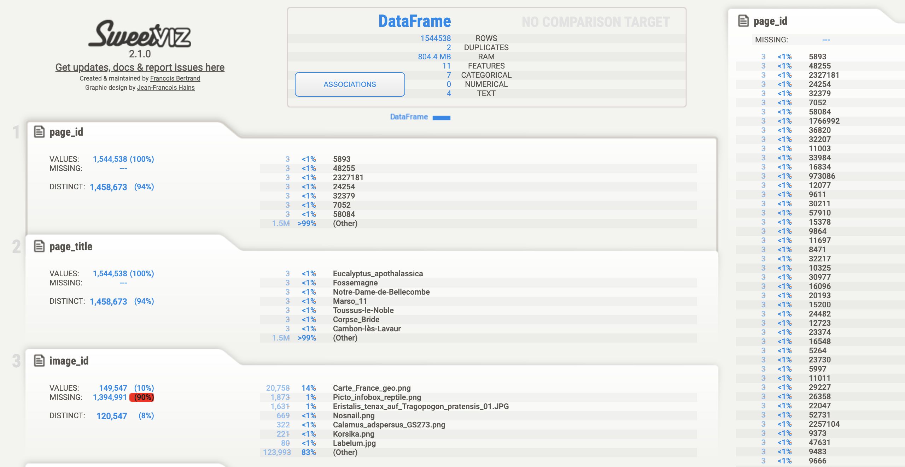
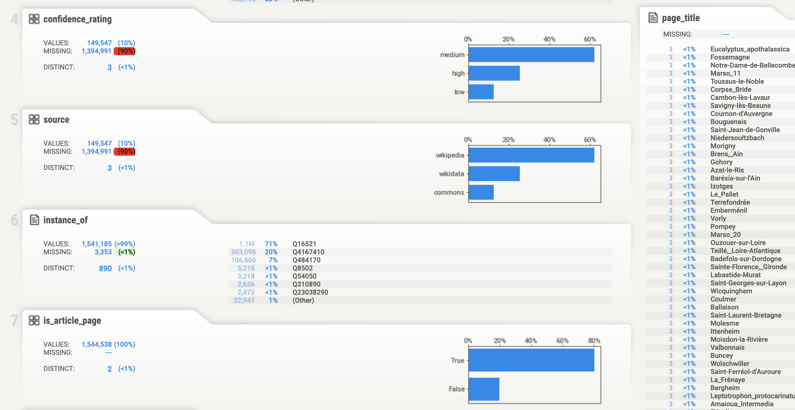
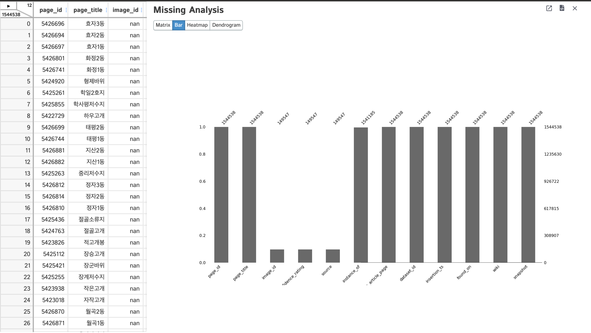

# Tools and approaches for generating dataset metrics

## Background

As part of the Image Suggestion project, we used a [jupyter notebook](../Dataset_metrics.ipynb) to generate
our dataset metrics. The process did give us some insights into our data but was tedious, not reusable for other
projects, and not easily accessible to other stakeholders of the project.

## Goals
- [ ] Create a template or find tools to easily generate dataset metrics for our current project and other future projects
- [ ] The output of template or tools should be accessible to all stakeholders

## Tools
### Pandas Profiling
[Pandas Profiling](https://github.com/pandas-profiling/pandas-profiling) is an open-source python package that provides
quick exploratory data analysis. An example of running Pandas profiling can be found in the [**Data_analysis**](Data_analysis.ipynb)
notebook.

An example of the generated dataset analysis using Pandas profiling can be found in [**cebwiki_image_sugg_pandas_analysis.html**](cebwiki_image_sugg_pandas_analysis.html)

Screenshots from the analysis:

#### Pros
- Easy to use
  - required a couple of lines of code to get started
- Provided valuable insight for most columns
  - ex: showed that for cebwiki `Carte_France_geo.png` image was recommended over 20,000 times
- HTML output has a great UI that is easy to read and navigate
  - Includes a `Toggle details` button that lets you dig more into the data
- HTML output can be made accessible to all stakeholders
- Active community

#### Cons
- Does not support lists
    - Could not analyze `found_on` column
- Significantly slows down with larger datasets
    - Struggled to analyze more than one wiki together
    - There is an option to [disable some expensive computations](https://github.com/pandas-profiling/pandas-profiling#large-datasets)
- Does not support comparing two datasets (ex: reference data vs current data)
  
### Sweetviz
[Sweetviz](https://github.com/fbdesignpro/sweetviz) is an open-source python package that provides high-density
visualizations to kickstart exploratory data analysis. An example of running Sweetviz can be found in the [**Data_analysis**](Data_analysis.ipynb)
notebook.

An example of the generated dataset analysis using Sweetviz can be found in [**cebwiki_image_sugg_sv_analysis.html**](cebwiki_image_sugg_sv_analysis.html).

Screenshots from the analysis:

#### Pros
- Easy to use
  - required a couple of lines of code to get started
- Supports comparing two datasets (ex: reference data vs current data)
- Provided valuable insight for most columns
  - ex: showed that less than 1% of cebwiki pages does not have an `instance_of` listed
- HTML output has a great UI that is easy to read and navigate
  - Highlights missing values
  - Pressing on each section provides more information about the data including graphs
- HTML output can be made accessible to all stakeholders
- Active community

#### Cons
- Does not support lists
    - Had to remove the `found_on` column for it to work
- Ran into issues when trying to analyze multiple wikis

### D-Tale
[D-Tale](https://github.com/man-group/dtale) is an open-source visualizer for panda data structures. An example of
running D-Tale can be found in the [**Data_analysis**](Data_analysis.ipynb)
notebook.

Screenshots from the analysis:

#### Pros
- Easy to use
  - required a couple of lines of code to get started
- Code export
  - Supports the export of code from any analysis or chart
- A server can be made accessible to all stakeholders
- Customizable options to analyze and show charts
- Active community

#### Cons
- Does not support comparing two datasets (ex: reference data vs current data)
- UI is more complex with more options
- Subpar missing analysis per column
  - Struggled to provide a percentage of rows with no image suggestions
  